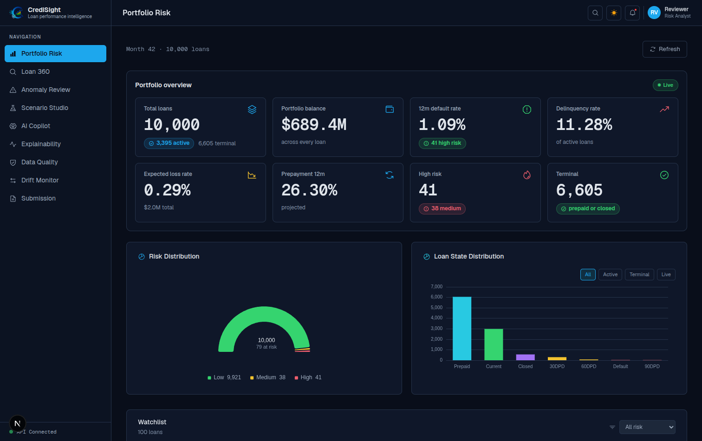
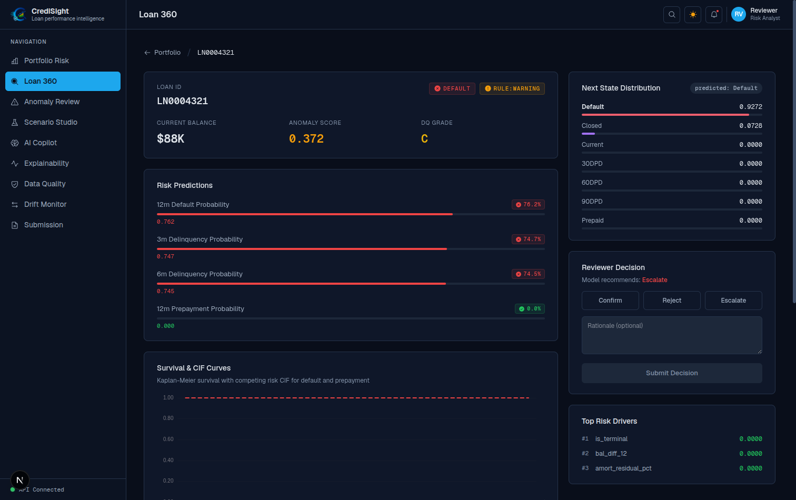
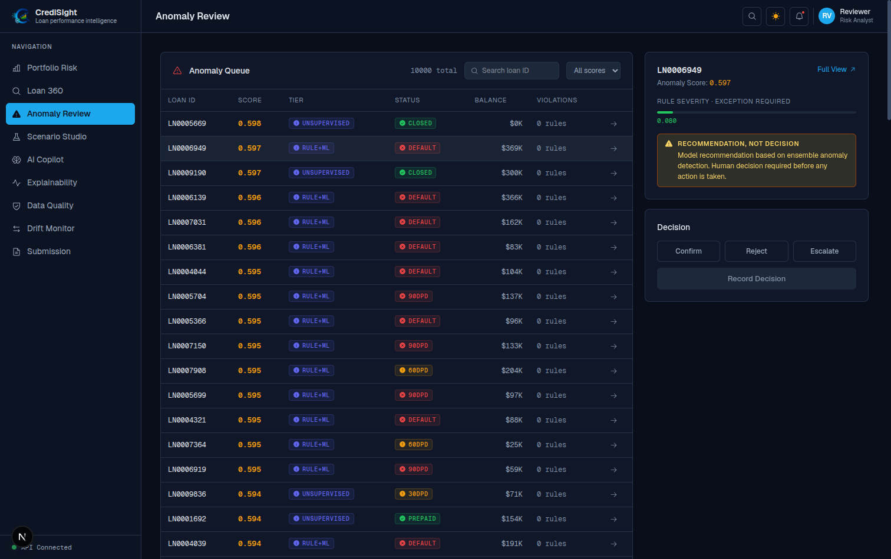
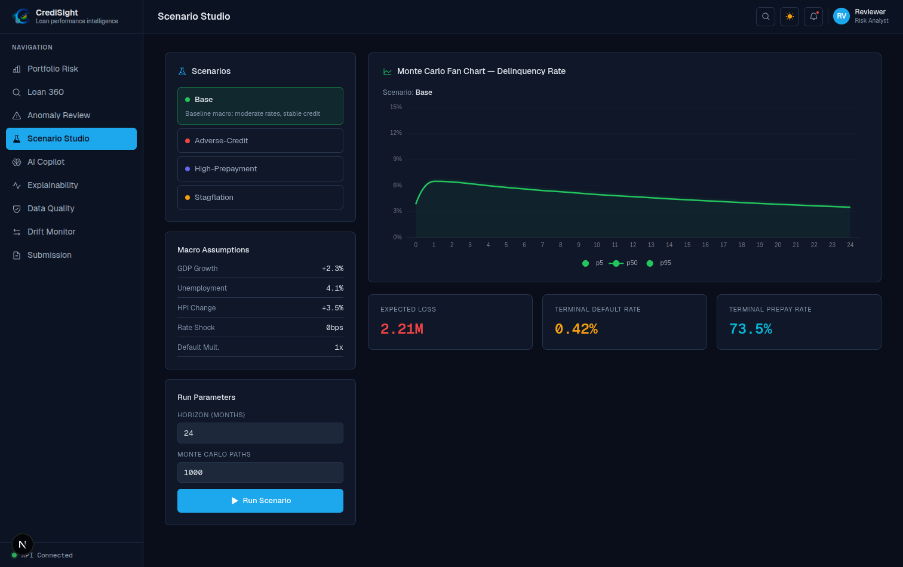
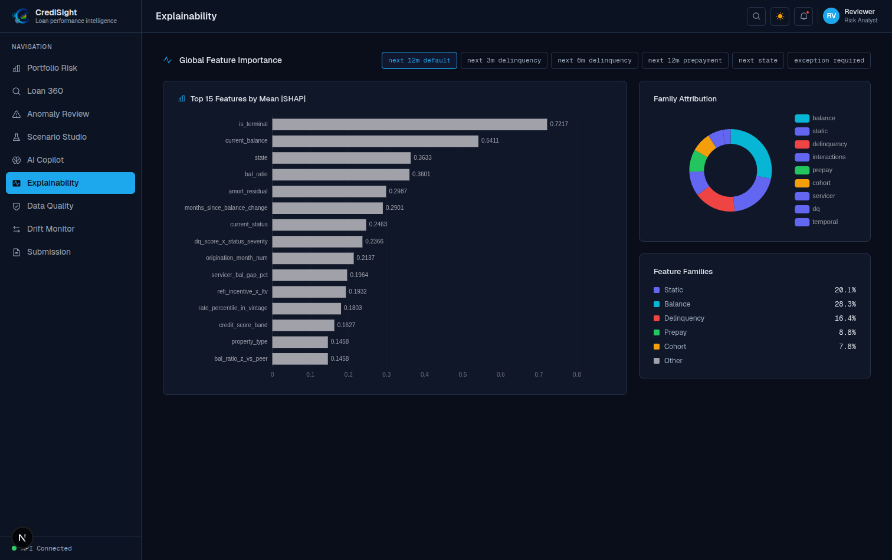
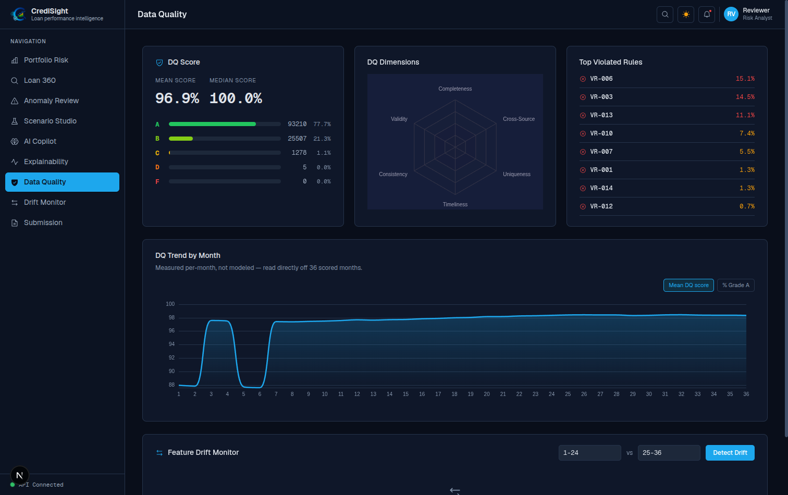
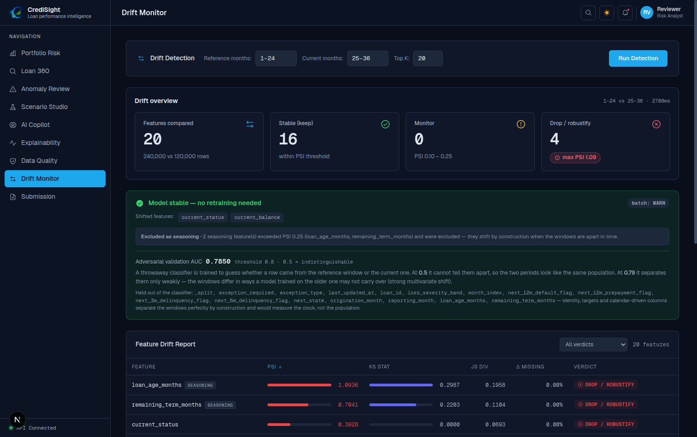
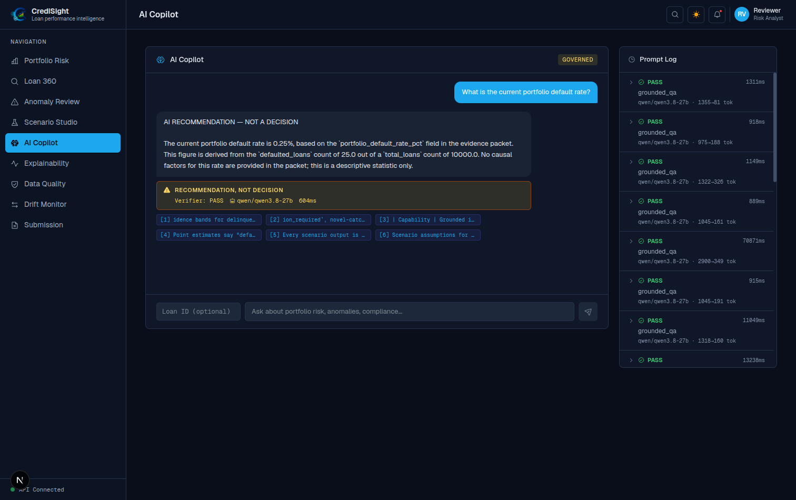
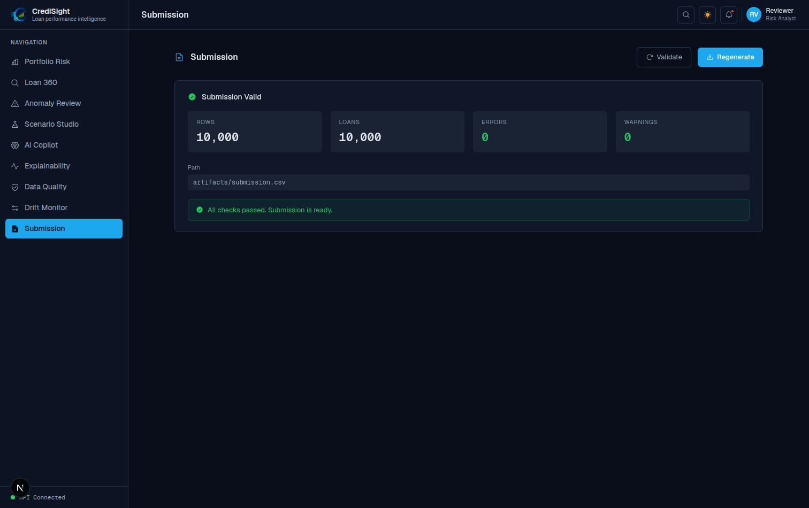
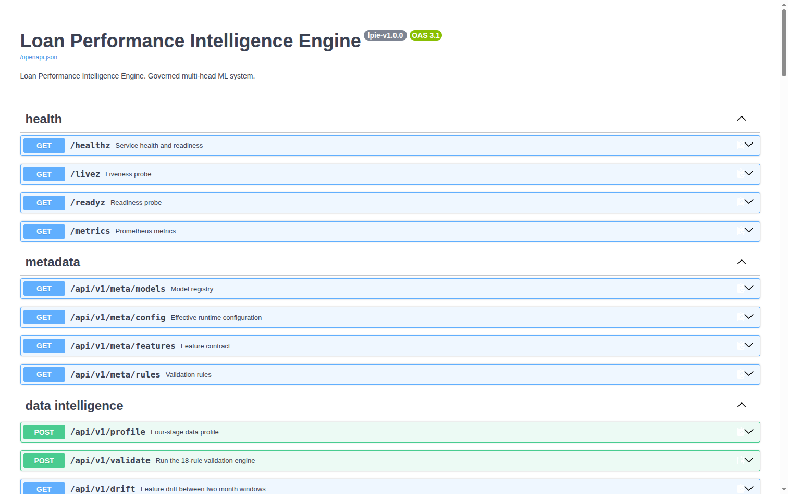

# Loan Performance Intelligence Engine (LPIE)

**Intain Campus FinTech Challenge 2026 — AI Track**

A governed loan-performance intelligence system for messy loan-level panel data. It profiles the
data, scores data quality, predicts delinquency, default, prepayment and next state, models
time-to-event with a competing-risk hazard core, detects anomalies, runs Monte-Carlo stress
scenarios, explains every output, and puts a numerically verified LLM copilot in front of a human
reviewer.

The predictive work is done by gradient-boosted trees and a discrete-time hazard model. The LLM
writes prose only, and every number it writes is checked against an evidence packet before a
reviewer sees it.



---

## Table of contents

- [Quick start](#quick-start)
- [What the system does](#what-the-system-does)
- [Screens](#screens)
- [Deliverables map](#deliverables-map)
- [Repository layout](#repository-layout)
- [Data](#data)
- [Pipeline](#pipeline)
- [Results](#results)
- [Time-aware validation and leakage control](#time-aware-validation-and-leakage-control)
- [Copilot governance](#copilot-governance)
- [API](#api)
- [Testing](#testing)
- [Configuration](#configuration)
- [Technology](#technology)
- [Limitations](#limitations)

---

## Quick start

### Prerequisites

| Requirement | Version | Notes |
|---|---|---|
| Python | 3.12 | Pinned; the dependency set is resolved against 3.12 |
| Node.js | 18 or newer | Only needed for the dashboard |
| Git LFS | any | Required — model artifacts are LFS objects |
| RAM | 4 GB free | The API loads about 220 MB of model artifacts at boot |

Git LFS matters. Clone with LFS enabled or the `.joblib` files arrive as text pointers and the API
will refuse to start:

```bash
git lfs install
git clone <repository-url>
cd <repository>
git lfs pull
```

### Run it

```bash
./scripts/setup.sh     # install Python + Node dependencies, create .env
./start.sh             # start the API on :8000 and the dashboard on :3000
```

Then open:

- Dashboard: http://localhost:3000
- API docs: http://localhost:8000/docs
- Health: http://localhost:8000/healthz

`./start.sh` runs both processes and shuts both down on Ctrl-C. It also accepts `--api-only`,
`--frontend-only` and `--setup`. `make start` and `make setup` are equivalent shortcuts.

The dashboard's portfolio, anomaly and data-quality screens read from a DuckDB feature store built
from the panel dataset, which is not committed. See [Data](#data) for the two ways to get it. The
API, its docs, the model registry and the explainability endpoints work from the committed
artifacts alone.

### Optional: enable the LLM copilot

The copilot is the only component that calls an external model. Without a key it degrades to a
deterministic, evidence-only answer rather than failing.

```bash
cp .env.example .env      # done automatically by setup.sh
# then edit .env and set GROQ_API_KEY=gsk_...   (free key from https://console.groq.com)
```

No key is committed to this repository. `.env` is gitignored; `.env.example` documents every
variable the system reads.

---

## What the system does

```
Loan panel (420,000 rows, 10,000 loans, 36 months)
  |
  v
18 deterministic validation rules  ->  record-level and batch-level DQ scores
  |
  v
145 engineered features in 9 families  ->  Parquet feature store, 8 leakage tests
  |
  v
Discrete-time competing-risk hazard core (softmax over 7 states, legal-transition mask)
  |
  +-- 5 direct GBDT heads: 3m delinquency, 6m delinquency, 12m default,
  |                        12m prepayment, next state
  +-- Stacked blender, then isotonic calibration per vintage x credit band
  +-- Absorbing-state gate: Prepaid and Closed resolved deterministically
  |
  v
4-detector anomaly ensemble fused with rule hits  ->  exception type and reviewer action
  |
  v
Monte-Carlo scenario engine (1,000 paths x 24 months, 4 scenarios)
  |
  v
TreeSHAP, conformal intervals, counterfactuals, error analysis
  |
  v
RAG-grounded copilot + numeric verifier  ->  reviewer recommendation, never a decision
  |
  v
FastAPI (40 routes) + Next.js dashboard  ->  submission.csv
```

Everything downstream of the hazard core is derived from it, so horizon probabilities, next-state
distributions, survival curves and scenario projections stay mutually consistent by construction
rather than by post-hoc reconciliation.

---

## Screens

### Portfolio risk

Portfolio KPIs, risk distribution, loan-state mix, and a ranked watchlist with per-loan default
probability, anomaly score, DQ grade and top driver.


### Loan 360

Full single-loan view: horizon probabilities, next-state distribution, Kaplan-Meier survival with
competing-risk CIF curves, top SHAP drivers, and the reviewer decision panel (confirm, reject,
escalate) with a free-text rationale.



### Anomaly review

Ranked anomaly queue with detector tier (rule + ML, or unsupervised), rule violations, severity and
exception type. Every card is labelled a recommendation, not a decision, and requires a recorded
human action.



### Scenario studio

Base, adverse-credit, high-prepayment and stagflation scenarios over a configurable horizon and
path count, with a Monte-Carlo fan chart and terminal default, prepayment and expected-loss
outputs.



### Explainability

Global TreeSHAP importance per head, feature-family attribution, and per-loan local explanations
with conformal confidence intervals.



### Data quality

Record-level DQ score distribution by grade, six DQ dimensions, most-violated rules, and a
per-month DQ trend read directly off the scored panel.



### Drift monitor

Train-versus-test drift with PSI, KS and JS statistics per feature, an adversarial-validation AUC,
and an explicit seasoning exclusion so calendar-driven shift is not misreported as data drift.



### AI copilot

Grounded question answering over the portfolio. Each answer carries retrieval citations, a verifier
badge, and a standing "recommendation, not a decision" label. The prompt log on the right records
model, verdict, latency and token count for every call.



### Submission

Generates and validates `submission.csv` against the required 15-column contract, with row, loan,
error and warning counts.



### API

40 documented routes under OpenAPI.



---

## Deliverables map

| Required deliverable | Where it is |
|---|---|
| Complete source code | `src/lpie/`, `frontend/` |
| Reproducible scripts | `Makefile`, `scripts/`, `start.sh` |
| `submission.csv` | `artifacts/submission.csv` (10,000 rows, 15 columns, 0 errors) |
| Data intelligence report | `reports/ingest_manifest.json`, `reports/feature_manifest.json` |
| Explainability report | `reports/evaluation.json` (SHAP, error analysis, uncertainty) |
| Scenario report | `reports/scenarios.json` |
| LLM copilot demo | `/copilot` screen; prompt log at `/api/v1/copilot/prompt-log` |
| Rejected LLM output examples | [`reports/llm_rejections.md`](reports/llm_rejections.md) |

---

## Repository layout

```
.
├── src/lpie/               Python package
│   ├── api/                FastAPI app, 15 routers, middleware
│   ├── copilot/            RAG index, LLM client, numeric verifier
│   ├── core/               config, logging, contracts
│   ├── data/               ingest, DuckDB store, SQLite app store
│   ├── features/           feature families, feature store
│   ├── models/             hazard, heads, stacking, calibration, registry
│   ├── pipelines/          stage runner (data, profile, features, train, ...)
│   ├── profiling/          distributions, missingness, outliers, drift, DQ
│   ├── scenario/           Monte-Carlo engine
│   ├── serving/            model state, prediction service
│   └── survival/           Kaplan-Meier, CIF, Markov baseline
├── frontend/               Next.js 15 dashboard (App Router, TypeScript, ECharts)
├── config/                 config.yaml, features.yaml, validation_rules.json
├── dataset/                small reference files (dictionary, rules, macro, template)
├── artifacts/models/       trained model artifacts (Git LFS)
├── artifacts/submission.csv
├── reports/                evaluation, performance, scenarios, manifests, rejections
├── screenshots/            dashboard screenshots used in this README
├── scripts/                setup, dataset generation, artifact download, verification
├── tests/                  101 tests
├── start.sh                one-command launcher
└── Makefile                pipeline stages
```

---

## Data

The panel dataset is roughly 80 MB and is **not committed**. Everything else needed to reason about
it is: `dataset/data_dictionary.md`, `dataset/validation_rules.json`,
`dataset/macro_scenarios.csv` and `dataset/submission_template.csv`.

The panel has 420,000 monthly rows across 10,000 loans over 36 months, plus origination attributes
and a conflicting second-source servicer feed.

### Option A: use the organizer data pack

Drop these files into `dataset/`:

```
loan_monthly_performance_train.csv
loan_monthly_performance_test.csv
loan_static_attributes.csv
servicer_updates.csv
```

### Option B: regenerate from public HMDA data

The panel was built from real HMDA public LAR records with a fixed seed (42), so regeneration is
deterministic.

```bash
./scripts/download_hmda.sh              # CFPB public LAR, 2019-2023 (large, resumable)
python3 scripts/generate_datasets.py    # writes the four CSVs into dataset/
```

### Then build the stores

```bash
make data        # ingest, validate, load DuckDB
make features    # build the Parquet feature store and run the leakage tests
```

After this the portfolio, anomaly and data-quality screens are fully populated. To retrain from
scratch instead of using the committed artifacts, run `make all`.

---

## Pipeline

Each stage is independently runnable and writes a manifest to `reports/`.

| Command | What it does |
|---|---|
| `make data` | Ingest, apply 18 validation rules, load DuckDB |
| `make profile` | Distributions, missingness, outliers, relationship breaks, drift, DQ scores |
| `make features` | 145 features in 9 families, Parquet store, 8 leakage tests |
| `make train` | Hazard core, 5 GBDT heads, stacking, calibration, thresholds |
| `make evaluate` | Survival curves, SHAP, error analysis, conformal coverage |
| `make simulate` | Monte-Carlo scenarios |
| `make submit` | Generate and validate `submission.csv` |
| `make all` | Every stage above, in order |
| `make test` | Full test suite |

---

## Results

All figures below are read from `reports/model_performance.json` and `reports/evaluation.json` as
produced by the committed artifacts. Metrics are out-of-fold under a time-aware split.

### Prediction heads

| Head | Base rate | ROC-AUC | PR-AUC | Brier | ECE |
|---|---|---|---|---|---|
| 3m delinquency | 0.1458 | 0.9451 | 0.6310 | 0.0555 | 0.0033 |
| 6m delinquency | 0.2410 | 0.9183 | 0.6663 | 0.0880 | 0.0034 |
| 12m default | 0.0231 | 0.9170 | 0.3270 | 0.0155 | 0.0027 |
| 12m prepayment | 0.4132 | 0.9308 | 0.9538 | 0.0900 | 0.0057 |

About 56 percent of rows in the hazard validation window sit in an absorbing state (Prepaid or
Closed), which inflates any headline metric. Active-conditional metrics, computed only on rows that can still
transition, are reported alongside:

| Head | ROC-AUC, overall | ROC-AUC, active-conditional |
|---|---|---|
| 3m delinquency | 0.9451 | 0.8823 |
| 6m delinquency | 0.9183 | 0.8155 |
| 12m default | 0.9170 | 0.8578 |
| 12m prepayment | 0.9308 | 0.7346 |

### Baseline comparison

A five-rung ladder is trained for every head so the gain from feature engineering and calibration is
separable from the gain of simply using a model. For 12m default:

| Rung | ROC-AUC | PR-AUC | Brier |
|---|---|---|---|
| B0 prior / majority | 0.5000 | 0.0195 | 0.0191 |
| B1 current-state lookup | 0.8526 | 0.2457 | 0.0157 |
| B3 LightGBM, raw columns, default params | 0.8509 | 0.2637 | 0.0776 |
| B4 LightGBM + full feature engineering | 0.8322 | 0.2166 | 0.0266 |
| B5 stacked + calibrated (champion) | 0.9256 | 0.3217 | 0.0154 |

B4 scoring below B3 on AUC is real and is left in the report rather than smoothed away: feature
engineering alone does not help this head, and the gain comes from stacking three decorrelated GBDT
families and calibrating. B2 (logistic regression) did not converge to a reportable metric on this
head and is recorded as unavailable.

### Next-state transition

| Metric | Overall | Active-conditional |
|---|---|---|
| Accuracy | 0.9543 | 0.8962 |
| Balanced accuracy | 0.9754 | 0.8478 |
| Macro F1 | 0.8454 | 0.7273 |
| Top-2 accuracy | 0.9730 | 0.9387 |

Hazard invariants hold exactly: all probabilities in [0, 1], every row sums to 1, maximum row-sum
error 2.22e-16.

### Time-to-event

10,000 loans, 39.73 percent censored, 5,504 prepayment events and 523 default events. Kaplan-Meier
overall and by credit band, competing-risk cumulative incidence for default against prepayment, and
a Markov transition-matrix baseline for comparison. The log-rank test across credit bands gives
p = 0.117, so segment separation is reported as not significant rather than claimed.

### Anomaly and exception

Four detectors: Isolation Forest, ECOD, an autoencoder and a self-supervised z-score, fused with
deterministic rule hits.

| Model | ROC-AUC | PR-AUC | Brier |
|---|---|---|---|
| Rules only | 0.9781 | 0.9633 | 0.0077 |
| Rules + residual ML | 0.9989 | 0.9954 | 0.0551 |

The hybrid wins on ranking but is worse calibrated (ECE 0.171 against 0.008), so the rules-only
probability drives the displayed exception score and the hybrid drives ranking only. Ceiling
analysis shows 99.4 percent of the positives the rules miss have a null `document_status`, which
bounds what any model can add here.

### Uncertainty

Split-conformal intervals at nominal 90 percent coverage:

| Head | Achieved coverage | Mean width |
|---|---|---|
| 3m delinquency | 0.9362 | 0.351 |
| 6m delinquency | 0.9464 | 0.495 |
| 12m default | 0.9425 | 0.030 |
| 12m prepayment | 0.9424 | 0.532 |

### Submission

`artifacts/submission.csv`: 10,000 rows, 15 columns, 0 errors, 0 warnings, no duplicate keys.
Reviewer actions distribute as 8,221 No Action, 1,675 Flag, 104 Escalate; exception rate 16.5
percent.

---

## Time-aware validation and leakage control

- Splits are **forward-chaining by `month_index`**, never random over rows. A loan never appears in
  both sides of a fold boundary.
- Each head trains only on months where its label is observable. The 12m default head can use
  months 1 to 24; months 25 to 36 are censored at the panel edge and are masked, not filled with
  zeros. 180,000 rows are masked for that head alone.
- An **embargo** separates the measurement window from the production window so calibration never
  reads a month the model scored.
- Calibration uses pooled out-of-fold embargoed predictions, isotonic, per vintage and credit band.
- **8 automated leakage tests** run in `make features` and gate the pipeline: no target column as a
  feature source, no `loan_id` predictive encoding, no positive temporal offset, justification
  required for elevated-risk features, and four more. All 8 pass.
- `month_index` is the only trusted time key. `reporting_month` is corrupted in the source pack
  (month 1 and month 2 both map to 2021-01) and is never used as a model input.

---

## Copilot governance

The copilot retrieves from the data dictionary and validation rules, then answers with citations.
Before an answer is displayed, a **numeric verifier** extracts every number in the generated text
and checks it against the evidence packet the answer was built from. A number that is not in the
packet fails verification.

- Every output is labelled "recommendation, not a decision" in the API response and the UI.
- Every call is logged with prompt, model, timestamp, verdict, latency and token counts, readable
  at `/api/v1/copilot/prompt-log` and on the copilot screen.
- Failures fall back to a deterministic answer built only from the evidence packet.
- Rejected and degraded outputs are catalogued in [`reports/llm_rejections.md`](reports/llm_rejections.md),
  including a case where the model asserted a 73 percent default probability that was not in the
  packet; the verifier rejected it and the model's actual figure was 8.7 percent.
- Reviewer decisions are recorded separately in SQLite. The LLM cannot write one.

Retrieval uses sentence-transformers when available and falls back to a deterministic TF-IDF index
with no network dependency, so the copilot behaves identically offline.

---

## API

40 routes. Full OpenAPI at `/docs`.

| Group | Routes |
|---|---|
| Health and meta | `/healthz`, `/livez`, `/readyz`, `/metrics`, `/api/v1/meta/models` |
| Data intelligence | `/api/v1/profile`, `/validate`, `/drift`, `/dq/summary` |
| Prediction | `/api/v1/predict`, `/predict/{loan_id}`, `/portfolio/summary`, `/portfolio/watchlist` |
| Survival | `/api/v1/survival/{loan_id}`, `/survival/segment`, `/survival/state-occupancy` |
| Scenario | `/api/v1/scenarios`, `/scenario/run`, `/scenario/custom`, `/scenario/sensitivity` |
| Anomaly | `/api/v1/anomalies`, `/anomalies/{loan_id}/{month}`, `/reviewer/decision` |
| Explainability | `/api/v1/explain/global`, `/explain/{loan_id}`, `/explain/counterfactual`, `/explain/errors` |
| Copilot | `/api/v1/copilot/ask`, `/copilot/reviewer-note`, `/copilot/scenario-summary`, `/copilot/prompt-log` |
| Submission | `/api/v1/submission/generate`, `/submission/validate` |

A quick end-to-end check against a running server:

```bash
python3 scripts/verify_endpoints.py
```

---

## Testing

```bash
make test
```

101 tests: **99 pass, 2 skip, 0 fail**. Coverage spans data contracts, hazard invariants,
time-aware split correctness, validation rules, calibration, the 8 leakage checks, scenario
invariants, the copilot verifier, submission format, and API smoke tests.

The 2 skips are both in `tests/test_scenario_invariants.py` and are known open issues, not optional
dependencies: the scenario propagation check and the state-occupancy check each hit a model
interface mismatch and skip rather than fail. The scenario engine itself runs correctly through the
API and the dashboard; these two invariant assertions do not currently execute. See
[Limitations](#limitations).

Tests that need a built feature store are marked `artifacts`. Without the dataset, run:

```bash
make test-fast
```

---

## Configuration

`config/config.yaml` holds every window, horizon and threshold. Values derivable from the data
(censoring cliffs, panel bounds, state space) are re-derived at runtime by the profiler and
override the file. Secrets never live there.

| Variable | Required | Purpose |
|---|---|---|
| `GROQ_API_KEY` | No | LLM copilot. Without it the copilot degrades to deterministic answers |
| `ANTHROPIC_API_KEY` | No | Alternative copilot provider |
| `HF_REPO_ID` | No | Hugging Face repo holding the large anomaly artifact for cloud deploys |
| `API_HOST`, `API_PORT` | No | Defaults 0.0.0.0 and 8000 |
| `NEXT_PUBLIC_API_URL` | No | Dashboard's API base URL, default http://localhost:8000 |
| `LPIE_API_KEY` | No | If set, enables a shared-secret gate on the API |

Copy `.env.example` to `.env` and fill in what you need. `.env` is gitignored.

---

## Technology

- Python 3.12, FastAPI, Pydantic v2, Uvicorn, structlog
- LightGBM, XGBoost and CatBoost as three decorrelated GBDT families, stacked
- DuckDB for analytics, SQLite (WAL) for application state, Parquet for the feature store
- lifelines for Kaplan-Meier and Cox baselines, plus a custom discrete-time competing-risk hazard
- SHAP (exact TreeSHAP), split-conformal prediction, PyOD for the anomaly ensemble
- MLflow (local file store, no server) for experiment tracking
- Groq or Anthropic for the copilot, with FAISS or TF-IDF retrieval
- Next.js 15, React 19, TypeScript, Tailwind CSS 4, ECharts

---

## Limitations

- The panel is synthetic, generated from real HMDA origination records. Transition dynamics are
  modelled, not observed, so absolute rates should not be read as market forecasts.
- `reporting_month` is corrupted in the source pack; only `month_index` is trustworthy as a clock.
- 12m default PR-AUC is 0.327 against a 2.3 percent base rate. Ranking is strong (6.97x lift in the
  top decile) but precision at high recall is limited by that base rate.
- Credit-band survival separation is not statistically significant (log-rank p = 0.117).
- The exception hybrid model is deliberately not used for calibrated probability, only for ranking.
- Scenario projections assume the macro shocks in `dataset/macro_scenarios.csv` propagate through
  fitted sensitivities; they are not a validated stress-testing framework.
- Two scenario-invariant tests skip rather than run, because of a model interface mismatch in the
  test harness (see [Testing](#testing)). The scenario engine works end to end, but those two
  invariants are currently unverified by the suite.
- No fairness or disparate-impact analysis is included. HMDA carries protected attributes, and the
  panel deliberately excludes them from the feature set, but that is exclusion, not an audit.

---

## Further reading

- [LLM rejection gallery](reports/llm_rejections.md) — where the model was wrong and what caught it
